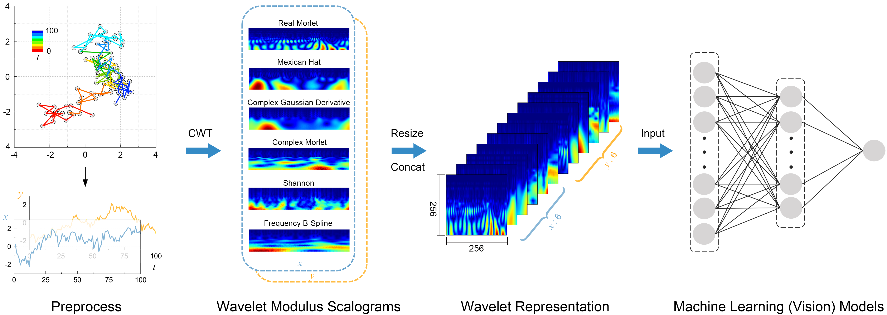

# Wavelet Representation for Anomalous Diffusion

Supporting codes of the data-efficient wavelet representation for anomalous diffusion

### Data-Efficient Learning of Anomalous Diffusion with Wavelet Representations: Enabling Direct Learning from Experimental Trajectories

#### Gongyi Wang, Yu Zhang, and [Zihan Huang](https://grzy.hnu.edu.cn/site/index/huangzihan)

School of Physics and Electronics, Hunan University, Changsha 410082, China

E-mail: huangzih@hnu.edu.cn

\


### 1. Data Generation

```python
# Generation
python cls_datasets_2d.py --N 1000 --l 100
```
*l* is the length, *N* is the number of trajectories.

### 2. Model Training

```python
python efficientnet.py 100 2 ./data-2d.1k-100-pp.csv ./data-2d.val-100-pp.csv
```

#### Environment:
* OS: Ubuntu 22.04
* GPU: NVIDIA TITAN RTX 24G
* Python==3.11.8
* PyTorch==2.2.1
* cuda==12.2
